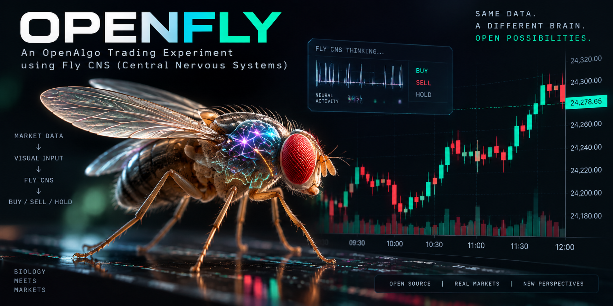

# OpenFly

A fruit fly's complete central nervous system, simulated from the public
MaleCNS v1.0 connectome (166,700 neurons, 25.6 million connections), wired
to the Indian options market through OpenAlgo. It runs one strategy:
intraday short straddles on the current-month NIFTY expiry, one at a time,
with volatility-sized stop losses on each leg, flat by 15:15 every day.

Everything on screen is real data: NIFTY one-minute bars (symbol NIFTY,
exchange NSE_INDEX) and recorded option chains from your own OpenAlgo
connection, stored locally in DuckDB. There is no demo, mock or generated
data anywhere in the project.

Status: built and tested end to end in paper mode. Paper trading through
OpenAlgo's analyzer mode is the default; live mode is locked behind an
explicit opt-in and a passed experiment. No profitable edge has been
demonstrated; see "What OpenFly is not" below.

## How the fly trades intraday straddles, in plain words

**What the fly is.** Scientists mapped every neuron and every connection in
a male fruit fly's brain and nerve cord. OpenFly loads that wiring diagram
and simulates it: each of the 166,700 neurons charges up from its inputs
and fires a spike when it crosses a threshold, exactly as the wiring says.
Nothing in the wiring knows anything about markets.

**What it sees.** Every minute during market hours (every few minutes in
live mode, at a cadence you choose) OpenFly paints a picture onto the fly's
eyes. The picture is made from the last 60 one-minute bars of NIFTY (how
much each bar moved, up or down), the INDIAVIX level, and how the current
straddle premium has moved since we sold it. Each column of the fly's eye
gets one bar, oldest at the edge and newest in the middle. The fly's 4,146
photoreceptor neurons turn that picture into spikes, and the spikes ripple
through the rest of the brain for a fraction of a simulated second.

**What we read from it.** We count the spikes in about 3,400 chosen
neurons (the 1,314 descending neurons that would normally drive the fly's
legs and wings, the 97 mushroom body output neurons that carry its
memories, and a fixed random sample of 2,000). A simple statistical readout
turns those counts into one number: how much NIFTY is expected to move in
the next hour compared with what the straddle premium is already pricing
in. Below 1 means calmer than priced. Above 1 means wilder than priced.

**The trade.** When the readout says calmer than priced (below 0.9 by
default) inside the trade window, OpenFly sells one call and one put at the
at-the-money strike of the current month's NIFTY expiry (the last expiry of
the calendar month, read from the exchange's expiry list), 65 quantity per
lot, product NRML. That is a short straddle: it earns as time passes and
the index stays near the strike, and it loses if the index runs far in
either direction. The trade is protected three ways:

- A stop loss on each leg, placed at the broker as an SL-M order the moment
  the straddle is sold. Its distance is not a fixed percentage: at every
  entry OpenFly works out how far NIFTY is expected to move in the next
  hour (the larger of what the straddle itself is pricing for that hour and
  what the last hour actually moved), converts that move into a premium
  rise for each leg using the option's delta and gamma, adds a 25 percent
  buffer, and places the stop there (clipped between 15 and 80 percent of
  the leg price). Once placed, that stop is held for the life of that
  straddle and never trailed; the next straddle gets fresh stops from the
  then-current volatility. If one leg is stopped out the other keeps
  running with its own stop.
- A combined stop and target on the two premiums added together, sized the
  same adaptive way (clipped between 10 and 50 percent), plus a take-profit
  when the sum falls 40 percent; after a 15 percent fall the combined stop
  moves to breakeven. A fixed-percentage mode remains available in Settings.
- The clock: no new trades before 09:20 or after 14:30, everything is
  squared off at 15:15, nothing is carried overnight, and no trading on
  holidays.

The readout can also say wilder than priced (above 1.1) while a trade is
open, which exits early.

**Dynamic straddles.** After any exit, whether a stop, a target or an early
exit, OpenFly is free to sell a fresh straddle at the new at-the-money
strike as soon as the readout says calm again, after a five minute pause.
The at-the-money strike is recomputed every minute for new entries, but a
straddle is always closed with exactly the contracts it was opened with.
Several straddles in a day are normal. Only one is ever open at a time:
entry, exit, then the next entry.

**What the fly does not decide.** Lot size, stop sizing, targets, timings,
margin checks and order handling are ordinary rules that a person sets in
the Settings page. A guard with eighteen named checks looks at every
proposal and can only say no; it never invents a different trade. Every
decision is logged with a plain-language explanation and the numbers
behind it, and any past day can be replayed minute by minute in the
browser.

## The reward function, in simple words

The fly can be run in two ways.

In the default way there is no reward at all. The readout is fitted on
history: for each observation we later know how much NIFTY actually moved
in the following hour, so we teach the readout to map spike patterns to
that outcome. Nothing inside the fly changes.

In the learning arm the fly's own dopamine neurons are used, the way a
real fly learns that a smell means sugar or shock. The reward for each
observation is decided one hour later, when the truth is known:

    reward = 1 - (how far NIFTY actually moved) / (how far the straddle premium said it would move)

That number is between -1 and +1. If the market moved half as much as
priced, the reward is +0.5. If it moved twice as much, the reward is -1.
We subtract the trading costs as a small fraction, and we subtract the
average reward of the last 20 trading days, so that ordinary quiet days
where premium simply decays do not count as brilliance; only being calmer
or wilder than usual counts. When a real straddle was actually open, that
trade's own profit or loss divided by the stop distance replaces the
formula for the observation that opened it.

A positive reward stimulates the fly's 15 PAM11 dopamine neurons, a
negative reward stimulates its 2 PPL101 dopamine neurons, with strength in
proportion to the size of the reward. Those neurons then adjust the
strength of 7,835 connections from Kenyon cells to two memory output
neurons, following a published learning rule. Whether that makes the fly a
better trader is exactly what the experiment harness measures, always
against a twin whose memory is frozen. The reward is never taken from
minute-to-minute swings in account value, because those are noise.

## What OpenFly is not

A connectome is a wiring diagram, not a strategy. No profitable learning by
a connectome simulation has been demonstrated anywhere and none is claimed
here. The experiment harness exists to find out whether the network
carries information about NIFTY's next hour; a readout passes only if it
beats a fixed 09:20 straddle, a random-entry control with the same number
of trades, a shuffled-label control and staying flat, on a test window it
was never tuned on. Until then OpenFly stays in paper mode.

## Install

You need three things: `uv` (Python package manager, it installs Python
3.12 for you), Node 20 or newer (only to build the web interface), and a
running OpenAlgo with your broker logged in (https://docs.openalgo.in).

### Windows (PowerShell)

```powershell
winget install --id=astral-sh.uv -e
winget install OpenJS.NodeJS.LTS
git clone https://github.com/marketcalls/openfly.git
cd openfly
uv sync
uv run app.py
```

### macOS

```sh
brew install uv node
git clone https://github.com/marketcalls/openfly.git
cd openfly
uv sync
uv run app.py
```

### Linux

```sh
curl -LsSf https://astral.sh/uv/install.sh | sh
# Node 20+: use your distribution's package or https://nodejs.org
git clone https://github.com/marketcalls/openfly.git
cd openfly
uv sync
uv run app.py
```

`uv run app.py` builds the web interface on first run, starts the server
at http://127.0.0.1:8000 and opens your browser. There is no configuration
file: enter your OpenAlgo host and API key in the Setup page; everything,
including the key, is stored in `data/openfly.db`.

### First run

1. Setup page: enter the OpenAlgo host (default http://127.0.0.1:5000) and
   API key, press Test connection. Your broker must be logged in inside
   OpenAlgo; when the broker session lapses, data calls fail until you log
   in again.
2. Setup page: press Prepare data. This downloads the 1.1 GB connectome
   (three files, CC-BY 4.0), verifies checksums and compiles the graph in
   about half a minute. Allow a few GB of disk and 16 GB of RAM.
3. Fetch market data once: `uv run openfly history get --exchange NSE_INDEX
   --symbol NIFTY --interval 1m --days 400` and `uv run openfly
   backfill-chains` (the current-month option chain, 12 strikes each side
   of the money, one-minute bars, as far back as your broker returns;
   weekly contracts for the last 7 days). Bars and chains are stored in
   `data/market.duckdb` and never fetched twice. After each trading day
   run `uv run openfly record` to add the day.
4. Replay page: pick any stored trading day and watch what the fly saw,
   what it concluded, what it would have traded and why, minute by minute.
5. Experiments page: run the walk-forward experiment. It reports whether
   the readout beats the controls and whether live mode may be unlocked.
6. Dashboard: start paper trading. OpenAlgo must be in analyzer mode; the
   app asks before switching it because that switch is global to your
   OpenAlgo installation.

### Command line

```sh
uv run openfly prepare              # download, verify and compile the connectome
uv run openfly verify               # checksums of sources and compiled arrays
uv run openfly circuits             # population sizes
uv run openfly benchmark            # seconds of wall time per 100 ms of neural time
uv run openfly observe-test         # white-field and dopamine-pulse sanity checks
uv run openfly chain                # current expiry chain and the ATM straddle
uv run openfly session              # today's trade window and expiry
uv run openfly costs --credit 204 --lots 1
uv run openfly history get --exchange NSE_INDEX --symbol NIFTY --interval 1m --days 400
uv run openfly backfill-chains      # option chains into DuckDB (monthly deep, weekly 7 days)
uv run openfly record               # today's chain after the close
uv run openfly calibrate-pricer     # fit the synthetic pricer to recorded chains
uv run openfly replay-day --date 2026-09-11
uv run openfly experiment run --encoder B --readout reservoir --neural-ms 100 \
    --train 2025-08-08:2026-03-31 --validation 2026-04-01:2026-06-30 --test 2026-07-01:2026-09-11
uv run openfly worker --mode paper --lots 1
uv run openfly serve                # the API and web interface without the browser launch
uv run pytest -q
```

Live mode additionally requires the environment variable
`OPENFLY_LIVE=I_ACCEPT_REAL_TRADES`, OpenAlgo out of analyzer mode, a
successful preflight and a passed experiment.

## What is inside

| Area | What it does |
| --- | --- |
| Connectome | Downloads the three MaleCNS v1.0 files, verifies SHA-256, keeps every neuron with a superclass (glia excluded) and every edge between them, compiles a CSR graph with 0.275 mV per synaptic contact and transmitter-based signs, and maps 3,335 R1-R6 and 811 R8 photoreceptors onto eye coordinates. |
| Brain | An exact event-driven leaky integrate-and-fire kernel in numba (0.1 ms step, 20 ms membrane, 5 ms synapse, 1.8 ms delay, 2.2 ms refractory, Kenyon cell adaptation), deterministic, single-threaded, about 0.9 s of wall time per 100 ms of neural time when the network is active. |
| Sensory | Three encoders: a rendered chart, retinotopic bars (default), feature patches. |
| Readout | The fixed DNp20 decoder (a control) and a ridge reservoir readout on descending, mushroom body output and random neurons. |
| Market | OpenAlgo REST and WebSocket client with retries and rate buckets, DuckDB store for bars and chains with fetch coverage, chain resolver (expiry list, ATM by synthetic forward), session calendar from exchange timings and holidays, cost model matching a discount broker's calculator. |
| Straddle engine | Entry, adaptive per-leg and combined stops, target, lock, early exit, time exit, dynamic re-entry, sizing from a risk budget, plain-language narratives. |
| Execution | Intent-before-send SQLite ledger, replay broker for simulations, OpenAlgo broker with basket entries, SL-M stops maintained at the broker, per-leg polling, reconciliation that halts on anything ambiguous. |
| Experiments | Simulate once, fit many: feature cache, calibrated Black-Scholes straddle pricer (recorded chains preferred), targets, reward series, light simulator, walk-forward runner with controls and block-bootstrap statistics. |
| API and UI | FastAPI serving the React interface: Setup, Dashboard, Brain, Replay, Experiments, Orders, Settings; charts by OpenAlgo Charts. |

Test suite: 328 backend tests and 13 frontend tests, all against in-memory
doubles; no test ever places an order.

## Documents

- [docs/ARCHITECTURE.md](docs/ARCHITECTURE.md): processes, packages, stores, and the path of one observation.
- [docs/PLAN.md](docs/PLAN.md): the design and its reasoning.
- [docs/api-spec.md](docs/api-spec.md): the backend API the web interface uses.
- [docs/neural.md](docs/neural.md), [docs/market.md](docs/market.md), [docs/execution.md](docs/execution.md), [docs/experiments.md](docs/experiments.md): package references.
- [docs/nifty-market-facts.md](docs/nifty-market-facts.md): measured index, VIX, straddle, margin and cost numbers.
- [docs/openalgo-notes.md](docs/openalgo-notes.md): the OpenAlgo endpoints, formats and gotchas OpenFly relies on.

## Stack

Backend: Python 3.12 via uv, numba, numpy, pandas, pyarrow, DuckDB,
FastAPI, SQLite. Frontend: Vite, React, TypeScript, Tailwind v4, shadcn,
openalgo-charts. Data: MaleCNS v1.0 (CC-BY 4.0; HHMI Janelia FlyEM,
University of Cambridge, MRC LMB, Google Research).

## Credits

- MaleCNS connectome: https://male-cns.janelia.org/
- Inspired by stonkfly: https://github.com/nftechie/stonkfly
- OpenAlgo: https://github.com/marketcalls/openalgo
- OpenAlgo Charts: https://github.com/marketcalls/openalgo-charts

## License

MIT. See [LICENSE](LICENSE).
