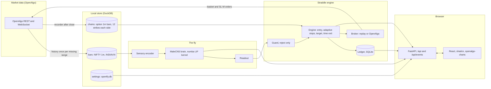

# OpenFly architecture

This document describes how OpenFly is put together: the processes, the
packages, the data stores, and the path one observation takes from a NIFTY
bar to a straddle order and back into the browser. It is written for
traders who want to know what is happening and for developers who want to
change it.

## 1. One picture



## 2. Processes

OpenFly is three kinds of process, all started from `uv run app.py` or the
`openfly` command line.

| Process | Started by | Owns | Talks to |
| --- | --- | --- | --- |
| API server (`openfly.api`) | `uv run app.py`, `openfly serve` | settings, event bus, static frontend, replay and experiment jobs | the browser, DuckDB, SQLite, the worker's files |
| Worker (`openfly.worker`) | API (start button) or `openfly worker` | the brain, the engine, the ledger of its run directory, the OpenAlgo connection | OpenAlgo REST and WebSocket, `runs/<run>/events.jsonl`, `state.json` |
| Jobs | API or CLI | one replay day, one experiment, one recorder run | DuckDB (read), `runs/replays`, `runs/experiments` |

The API never touches the brain in-process; it reads the worker's
`state.json` and tails `events.jsonl`. A worker holds a file lock on its run
directory so two workers cannot trade the same account.

## 3. Packages

```
openfly/
  config.py       PATHS and the SQLite SettingsStore (zero config)
  interfaces.py   shared dataclasses and protocols at every boundary
  cli.py          `openfly` entry; each package registers its subcommands
  connectome/     download, verify, normalize, compile graph.npz
  neural/         numba kernel, Brain (BrainProtocol), plasticity, benchmark
  sensory/        encoders A (chart), B (bars), C (features), eye map, PNG rendering
  readout/        fixed DNp20 decoder, ridge and logistic reservoir readout
  market/         OpenAlgo client, LTP feed, DuckDB BarStore, history cache,
                  chain resolver, session calendar, cost model, recorder
  straddle/       guard, engine, run_day (the shared replay of one day)
  execution/      ledger, brokers (replay, OpenAlgo), dispatch, cost adapters
  worker/         live and paper loop, factories, stand-ins
  experiments/    data loader, pricer, quotes, targets, reward, feature cache,
                  light simulator, metrics, runner
  api/            FastAPI app, routers, event bus, static frontend
frontend/         Vite, React, TypeScript, Tailwind v4, shadcn, openalgo-charts
```

Boundaries are protocols in `openfly/interfaces.py`: `BrainProtocol`
(`observe(stimulus, neural_ms)`), `EncoderProtocol` (`encode(observation,
brain)`), `ReadoutProtocol` (`predict(counts, brain, observation)`),
`BrokerProtocol` (`execute(intent)`), plus the data types `Bar`, `Contract`,
`Quote`, `StraddleQuote`, `MarketObservation`, `Stimulus`, `Prediction`,
`Intent`, `Fill`. Every package was built against these and tested with
fakes, which is why they could be developed in parallel.

## 4. Data stores

| Store | File | Content | Written by |
| --- | --- | --- | --- |
| Connectome sources | `data/malecns/*.feather` | the three MaleCNS v1.0 flat-connectome files, SHA-256 verified | `openfly prepare` |
| Compiled graph | `data/graph.npz`, `graph.lock.json`, `graph-manifest.json` | CSR arrays, weights, annotations, photoreceptor geometry, per-array hashes | `openfly prepare` |
| Market store | `data/market.duckdb` | `bars` (every bar ever fetched), `coverage` (ranges already fetched, so holidays never trigger refetches), `chains` (option 1m bars, 12 strikes each side of ATM per day), `chain_days` | history cache, recorder, backfill |
| Settings | `data/openfly.db` | one JSON row per settings section, including the OpenAlgo key (write-only through the API) | Setup and Settings pages |
| Feature cache | `data/features/<encoder>_<neural_ms>_<interval>/<date>.parquet` | spike counts per selected neuron per observation, so readouts can be refitted without re-simulating | experiment runner |
| Run directory | `runs/<run>/ledger.sqlite`, `events.jsonl`, `state.json`, checkpoints | intents, legs, fills, stop orders, day P&L, every decision step | worker |
| Replays | `runs/replays/<id>/trace.json`, `stimulus/<i>.png` | one day's 375 decision steps | replay job |
| Experiments | `runs/experiments/<id>/result.json`, `trades.json`, `readout/` | metrics, controls, curves, fitted readout | experiment runner |

The broker is asked for history exactly once per missing date range; bar
replay, experiments and the frontend never call the broker for bars.

## 5. The path of one observation

Every completed bar (1 minute in replay and simulation, the configured
cadence in live mode) goes through the same eight steps. The trace step
written to `events.jsonl` or `trace.json` records all of them.

1. **Observation.** `MarketObservation`: the trailing 60 bars of NIFTY
   (NSE_INDEX), INDIAVIX, the current ATM straddle premium and entry
   credit, days to expiry, minutes since open, position lots. Past only.
2. **Encoding.** The encoder turns the observation into luminance for the
   3,335 R1-R6 and 811 R8 photoreceptors (encoder B: one bar per eye
   column, return in the luminance, range in the green channel, VIX and
   premium change in the blue channel). `stimulus_hash` is recorded.
3. **Simulation.** `Brain.observe` runs the kernel for `neural_ms` of
   simulated time in 10 ms bins: photoreceptor drive 30 L / (h + L) mV,
   lamina 12 mV, optional dopamine pulses. It returns spike counts for all
   166,700 neurons; `rates_hz` per population goes into the step.
4. **Readout.** The reservoir readout standardizes log(1 + counts) of the
   descending neurons, MBONs and a fixed random sample, applies a ridge
   model fitted on history, and returns `realized_over_implied` with a
   decision under the hysteresis band (ENTER below 1 - tau, EXIT above
   1 + tau). The fixed DNp20 decoder is computed alongside as a control.
5. **Guard.** Eighteen named checks (trade window, last entry, expiry,
   VIX ceiling, spread, quote age, index move, daily loss, entries per day,
   re-entry cooldown, position flat, lots, margin, STOP file, halted,
   pending intent, prediction present, trading day) each with a
   plain-language detail. The guard only says yes or no.
6. **Engine.** If flat and allowed: size lots from the risk budget, compute
   the adaptive stops (expected one-hour move from the larger of implied
   and realized, converted to a premium rise per leg with delta and gamma,
   times the buffer, clipped), and emit an ENTRY intent with two SELL legs
   at the current ATM, followed by a STOPS intent with one SL-M order per
   leg. If in position: on every tick check the combined stop, target,
   lock, readout EXIT and the 15:15 deadline; exits always close exactly
   the entered contracts.
7. **Execution.** The ledger records the intent as PREPARED before any
   network call; the broker marks it UNKNOWN, sends the basket, polls each
   leg, settles fills, places or cancels stop orders, and reconciles lost
   responses against the orderbook by strategy tag; anything ambiguous
   halts the worker. The replay broker does the same against recorded or
   synthetic minute quotes with slippage and the cost model.
8. **Narrative.** The engine writes two texts per step: `narrative` for
   traders ("Expected one-hour move 95 points... call stop 31 percent at
   132.3") and `technical` with every number behind it. The API streams
   the step to the browser.

## 6. Replay and simulation

`openfly.straddle.replay.run_day` is the single implementation of a trading
day used by the Replay page, the `replay-day` command and the worker's
offline mode. It walks the day's 1 minute bars from 09:15, warms the brain
before 09:20, runs the eight steps above at every bar, feeds the engine the
minute path between observations for stops, and writes a `DayTrace` with
375 steps and a summary (P&L, trades, stop hits per leg, target hits,
fraction of synthetic premium minutes). Premiums come from recorded chains
in DuckDB when the day has them and from the calibrated Black-Scholes
pricer otherwise; every step says which (`premium_source`).

The experiment runner is the batch version: a feature pass writes the
cache for every day in the train, validation and test windows (simulate
once), then readouts are fitted and selected from the cache (fit many) and
evaluated with a light simulator that applies the same entry, adaptive
stop, target and time-exit rules and the same cost model, against the
controls (fixed 09:20 entry, random entry with matched trade count,
shuffled labels, flat). A readout passes only if it beats the controls on
the untouched test window with a block-bootstrap p-value below 0.05.

## 7. Safety layers, from the outside in

1. OpenAlgo analyzer mode is the default; the worker refuses paper mode if
   the analyzer is off and refuses live mode without
   `OPENFLY_LIVE=I_ACCEPT_REAL_TRADES`, a preflight and a passed experiment.
2. Session calendar from the exchange timings and holidays; nothing runs
   on a closed day; square-off at 15:15 with the exit basket sent early.
3. Guard: reject-only, every check visible.
4. Per-leg SL-M stops at the broker, maintained until the leg is closed.
5. Combined stop, target and lock in software on every tick.
6. Ledger: intent before send, one pending intent at a time, idempotent
   settlement, halt on any unresolved outcome. Exits close exactly the
   entered contracts, cross-checked against the ledger.
7. Kill switch in the header: square off, then stop.

## 8. Frontend

React with shadcn components and openalgo-charts. Pages: Setup (host, key,
data preparation), Dashboard (NIFTY candles and the premium pane with stop
and target levels, straddle card, latest decision, worker controls, kill
switch), Brain (stimulus image, population heatmap, DNp20 gauge, prediction
band), Replay (date picker, run form, timeline with numbered straddles,
scrubber, speed, virtualized steps table, decision panel), Experiments
(runs, curves against controls, metrics, verdict), Orders (ledger intents
next to the OpenAlgo books), Settings (strategy, risk, neural, costs,
analyzer toggle with confirmation). The typed API client mirrors
`docs/api-spec.md`; a mock mode with a real NIFTY day makes every page
demoable without a backend.

## 9. Model assumptions you should know

- Weight per synapse is 0.275 mV times the contact count, with sign from
  the presynaptic neurotransmitter prediction (acetylcholine positive;
  GABA, glutamate, histamine negative; unknown positive).
- The 390 synapses from R8 photoreceptors onto the six aMe12 neurons are
  made excitatory. Without this, visual input never reaches the Kenyon
  cells or most descending neurons; with it, a bright field produces
  thousands of Kenyon cell spikes per observation. The choice is recorded
  in every run's provenance with the edge hashes.
- Photoreceptor transfer 30 L / (0.5 + L) mV, lamina 12 mV constant.
- Modulatory neurons (dopamine, serotonin, octopamine) have no fast
  postsynaptic effect; the plastic arm applies the KC to MBON rule only.
- The straddle pricer is Black-Scholes with IV from INDIAVIX, calibrated
  to a recorded contract (factor 1.0056); recorded chains replace it as
  they accumulate.

## 10. Performance

Compiling the graph takes about 22 seconds and 2.2 GB. In the active
regime the kernel costs about 0.9 seconds of wall time per 100 ms of
neural time, so one observation at the default 100 ms neural time is about
0.9 seconds: a full 1 minute day replays in roughly six minutes, and a
year of 1 minute bars is a day and a half of compute for one arm. The
kernel is single-threaded and deterministic; independent arms run as
separate processes.
